# 🌌 Wallpapers Collection

A bunch of wallpapers I’ve made + collected from around the internet.

Total Wallpapers: **53**

<a href='anime-snake-portrait.png'>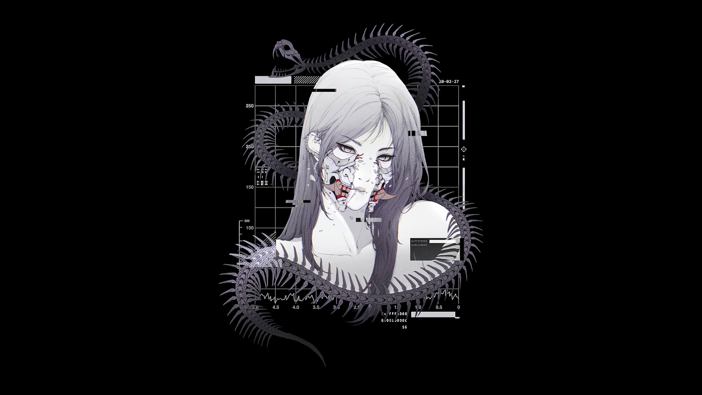</a>

<a href='astronaut-jellyfish.png'>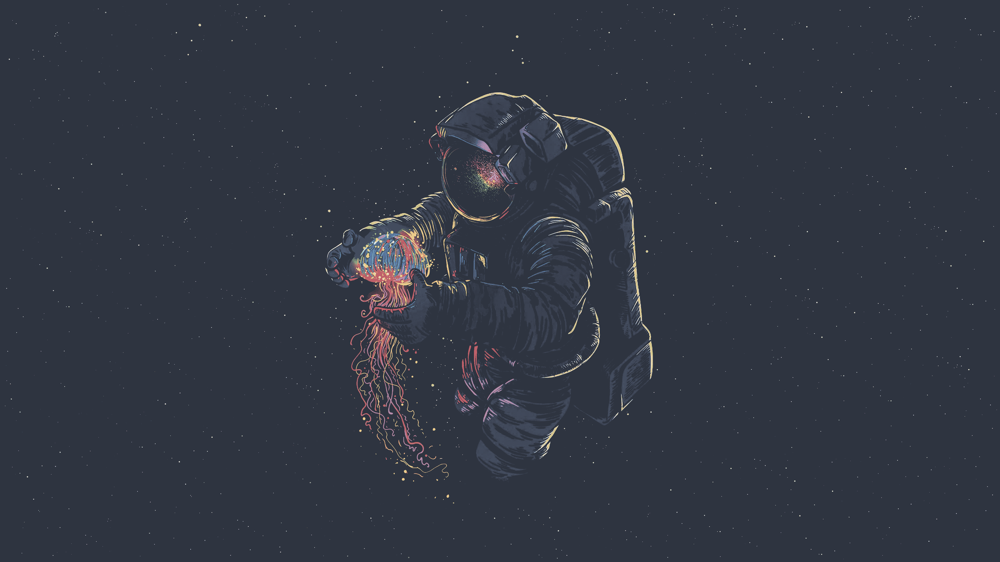</a>

<a href='cyberpunk-night-city.png'>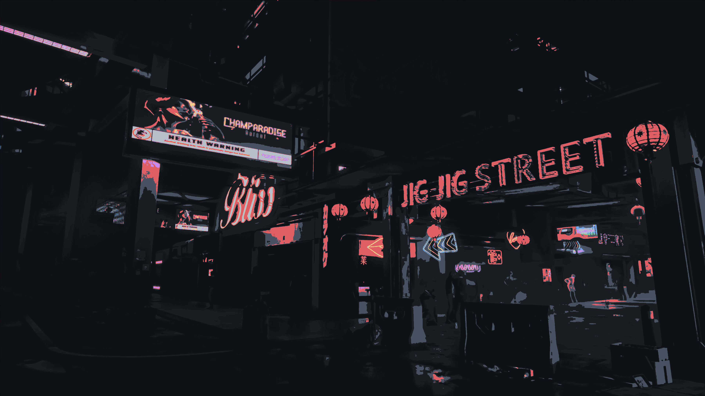</a>

<a href='gruvbox-dark-cyberpunk-japanese-city.jpg'>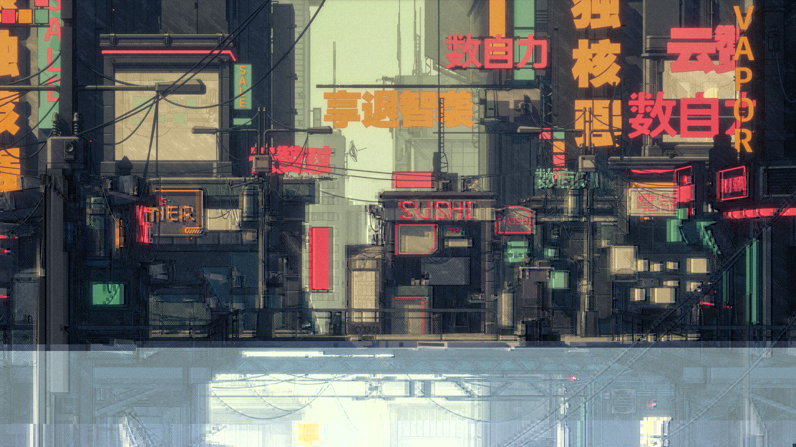</a>

<a href='gruvbox-dark-japanese-robot.png'>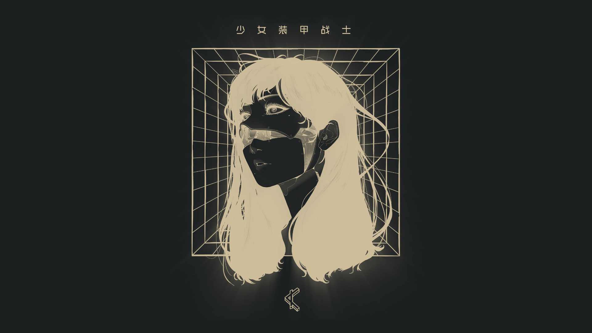</a>
<a href='gruvbox-dark-pacman.png'>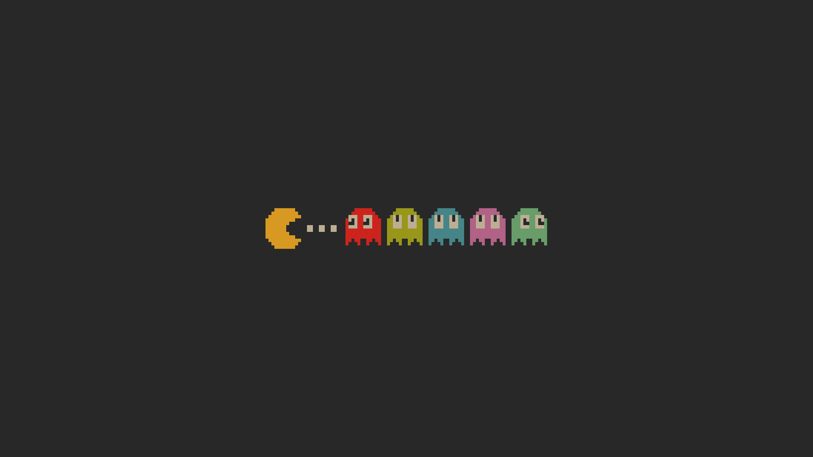</a>
<a href='gruvbox-light-mountains.png'>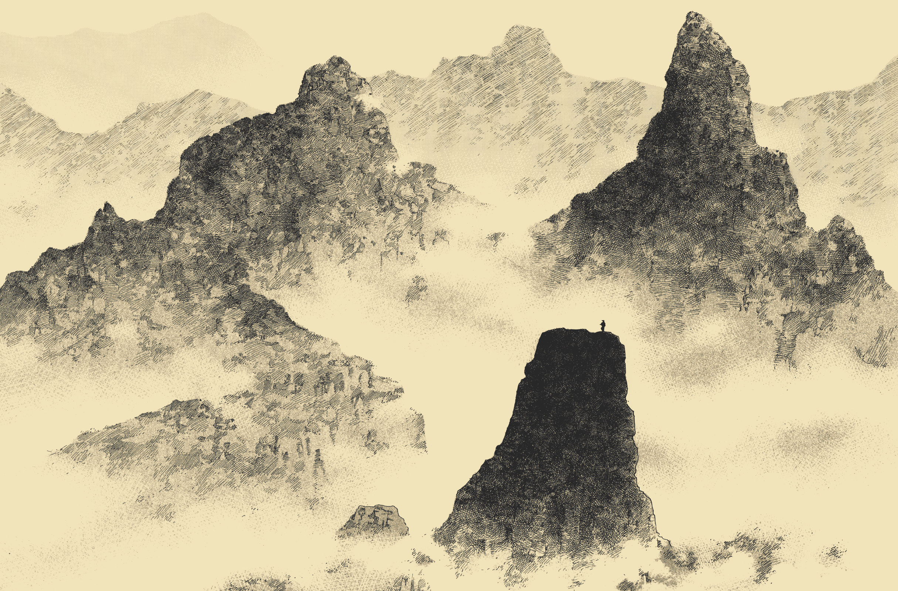</a>

<a href='hollow-knight.png'>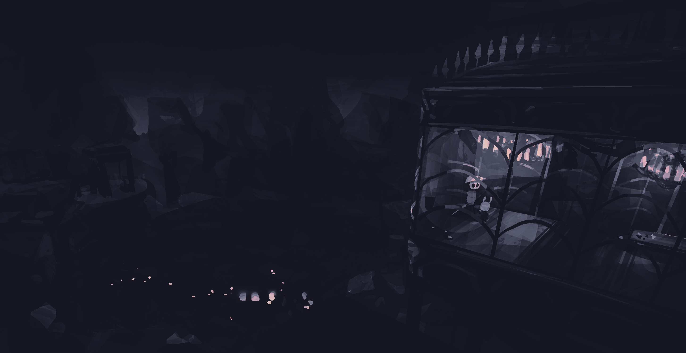</a>

<a href='lofi-girl-window.png'>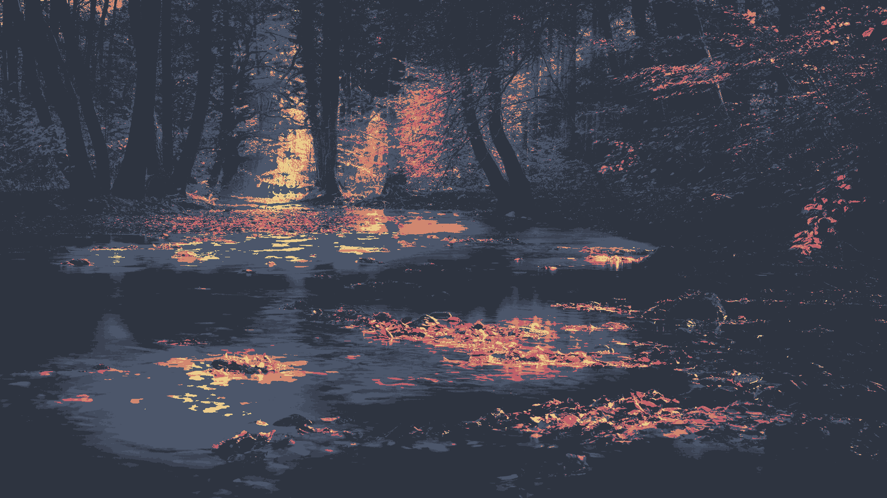</a>

<a href='manga-shrine.png'>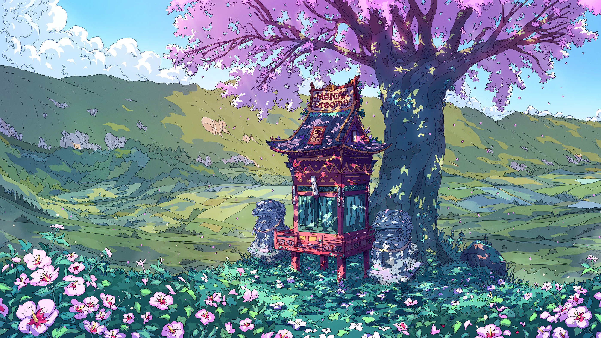</a>

<a href='minimalist-space-person.jpg'>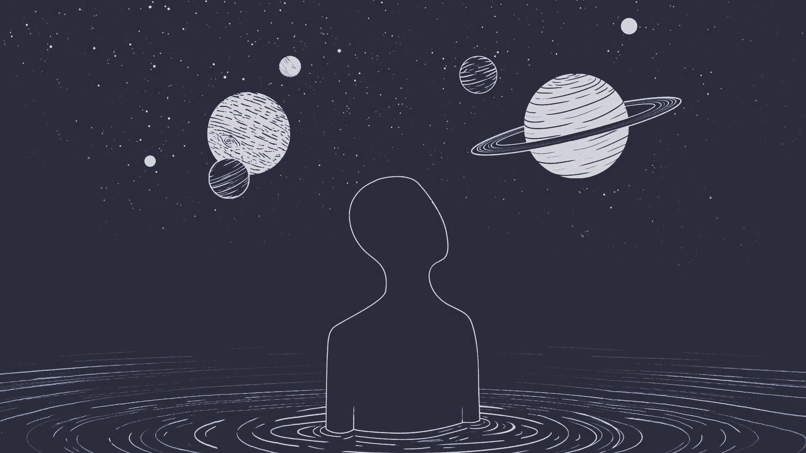</a>

<a href='mountain-valley-art.jpg'>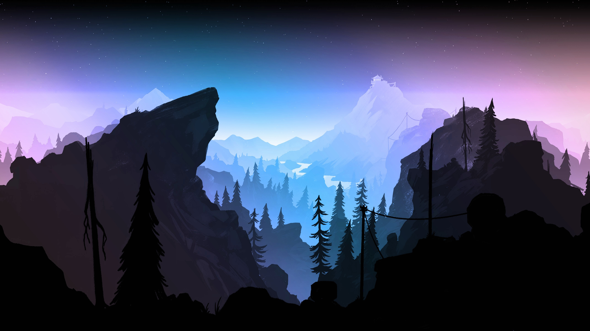</a>

<a href='nord-dark-asian-town.png'>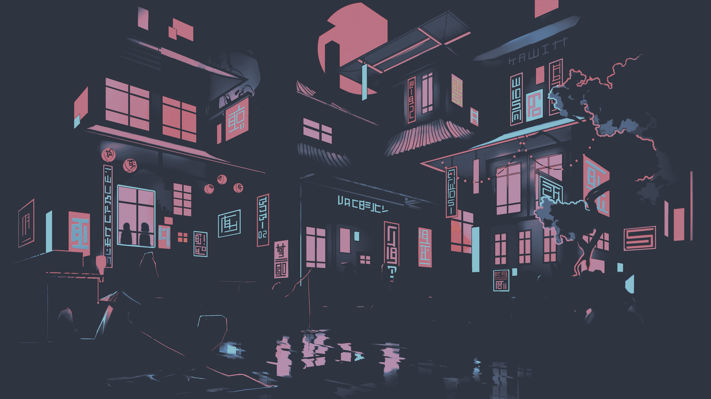</a>

<a href='nord-space-astronaut.png'>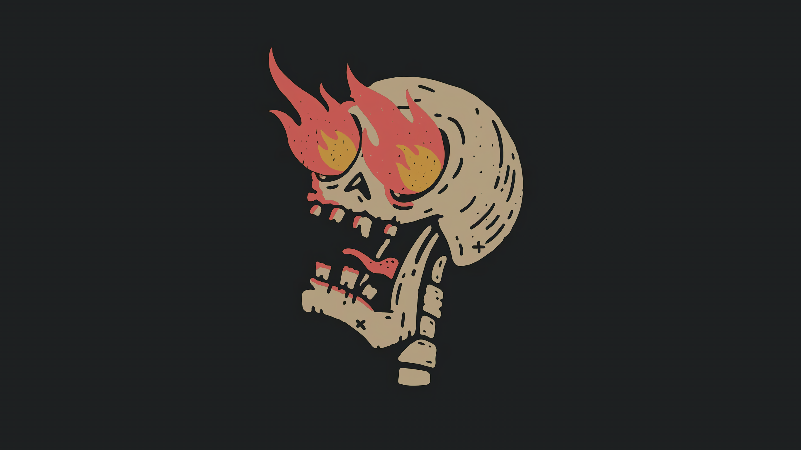</a>

<a href='nord_lake.png'>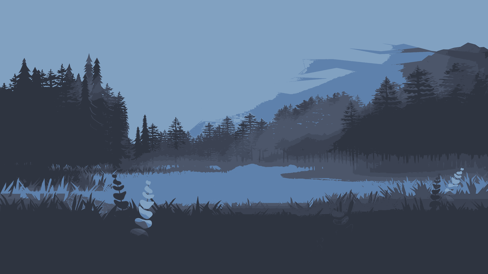</a>

<a href='sakura-aura.jpg'>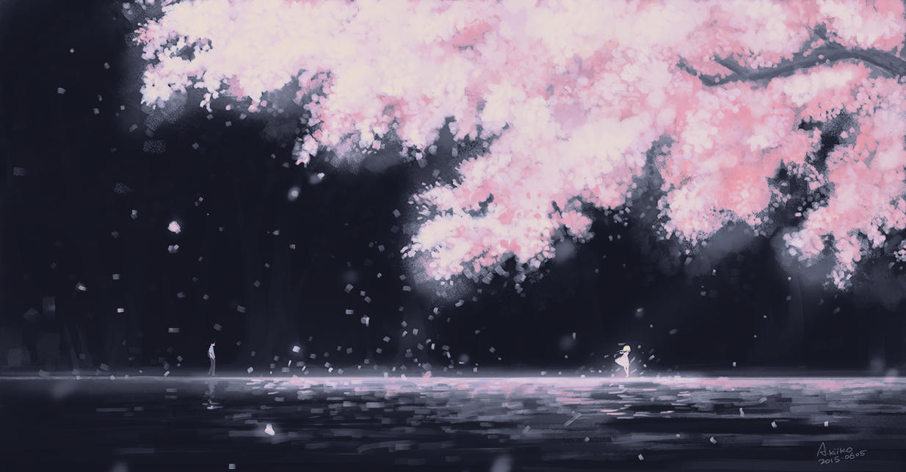</a>

<a href='samurai-snow.png'>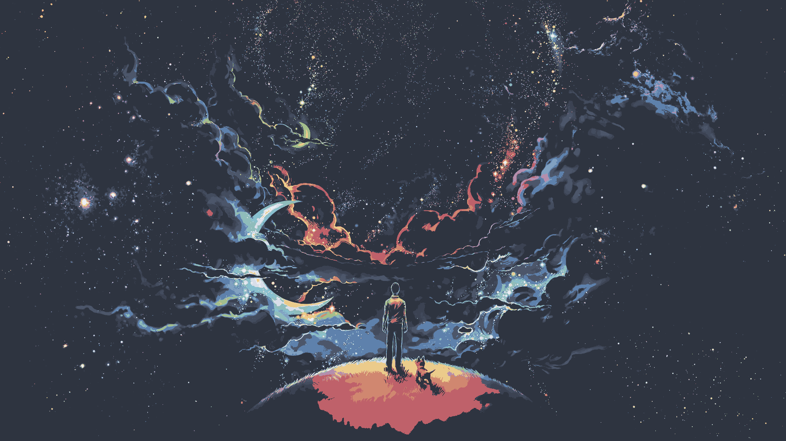</a>

*Generated automatically by `wallpaper-gui.py`*