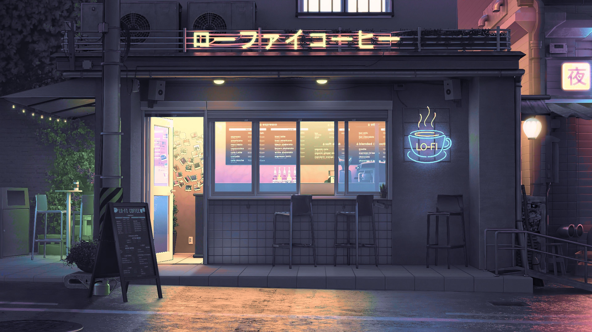
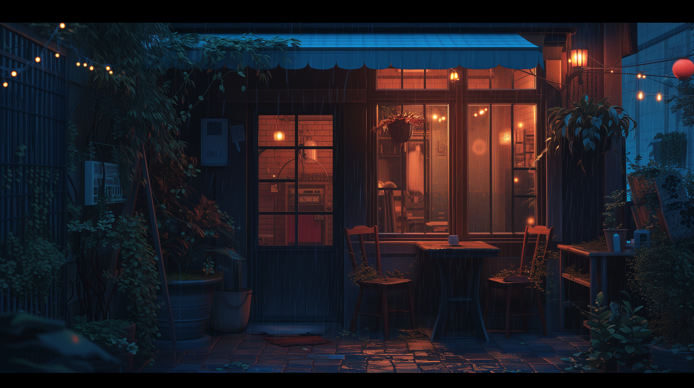
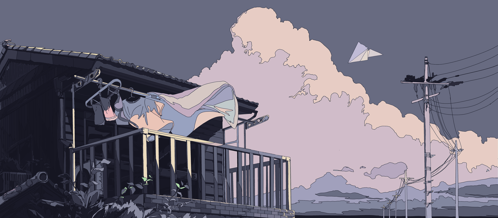
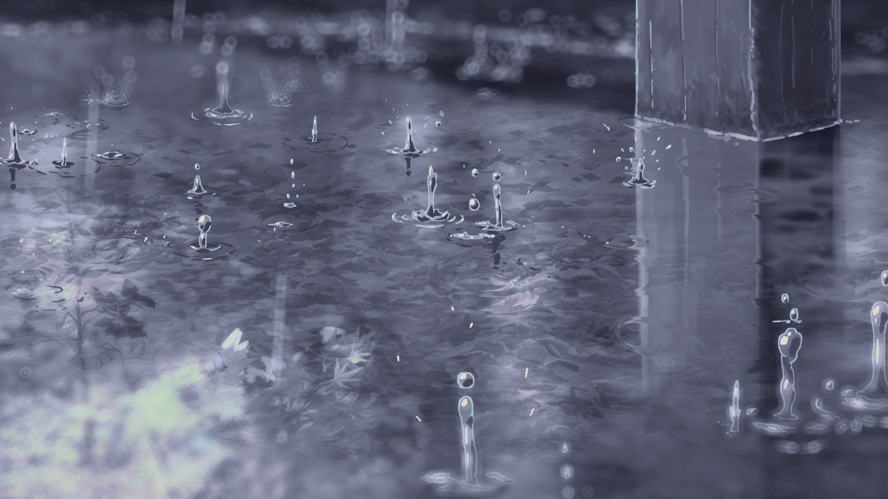
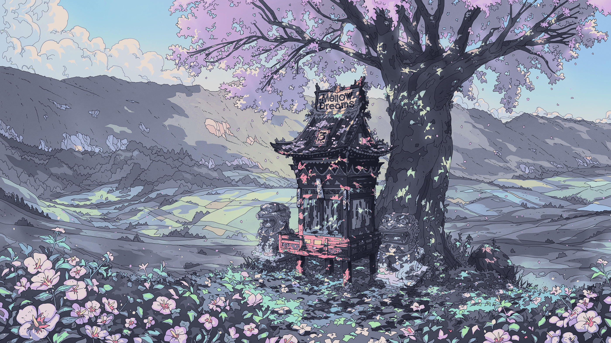

# 🌌 Wallpapers Collection

A bunch of wallpapers I’ve made + collected from around the internet. If you recognize your work and would like credit or removal, feel free to reach out. Anyone is welcome to use these wallpapers for personal use.

Total Wallpapers: **53**

Click on any image to view it in full resolution.

---

---

*Generated automatically by `auto_readme.py`*